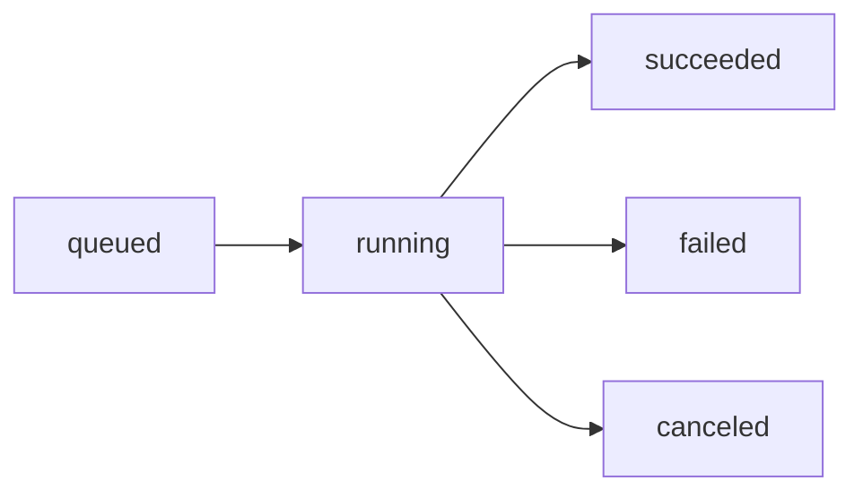

<Info>
**Type:** Read · **Required scope:** `decks:read` · **Cost:** Free
</Info>

## Parameters

<ParamField path="job_id" type="string" required>
  The job ID returned by [`create_deck`](/tools/create-deck).
</ParamField>

## Response

<ResponseField name="status" type="string">
  One of `queued`, `running`, `succeeded`, `failed`, `canceled`.
</ResponseField>
<ResponseField name="progress" type="object | null">
  While running, `progress.slides_done` shows how many slides are finished.
</ResponseField>
<ResponseField name="credits_charged" type="integer | null">
  Final credits charged once settled; refunded to `0` on failure or cancel.
</ResponseField>

<Expandable title="Example response">
```json
{
  "id": "job_abc123",
  "status": "running",
  "prompt": "10-slide investor pitch...",
  "master_id": null,
  "slides_requested": 10,
  "credits_reserved": 100,
  "credits_charged": null,
  "progress": { "slides_done": 4 },
  "error": null,
  "created_at": "2026-06-23T10:00:00Z",
  "finished_at": null
}
```
</Expandable>

## Status lifecycle



| Status | `progress.slides_done` | `finished_at` | `credits_charged` |
| --- | --- | --- | --- |
| `queued` | `null` | `null` | `null` |
| `running` | Updates as slides finish | `null` | `null` |
| `succeeded` | Equal to slides produced | Set | Final value |
| `failed` | Last value before failure | Set | Refunded to 0 |
| `canceled` | Last value | Set | Refunded to 0 |

## Polling recommendations

<Tip>
Claude polls automatically. You only need to call this tool manually if you're building a custom integration.
</Tip>

- Poll every **10 seconds** while status is `queued` or `running`.
- A 10-slide deck typically takes **3–7 minutes**; a 40-slide deck up to **20 minutes**.
- Stop polling as soon as status is `succeeded`, `failed`, or `canceled`.

## Errors

| Error | Cause |
| --- | --- |
| `Deck job 'X' not found` | Invalid job ID, or it belongs to another account. Call [`list_decks`](/tools/list-decks). |
