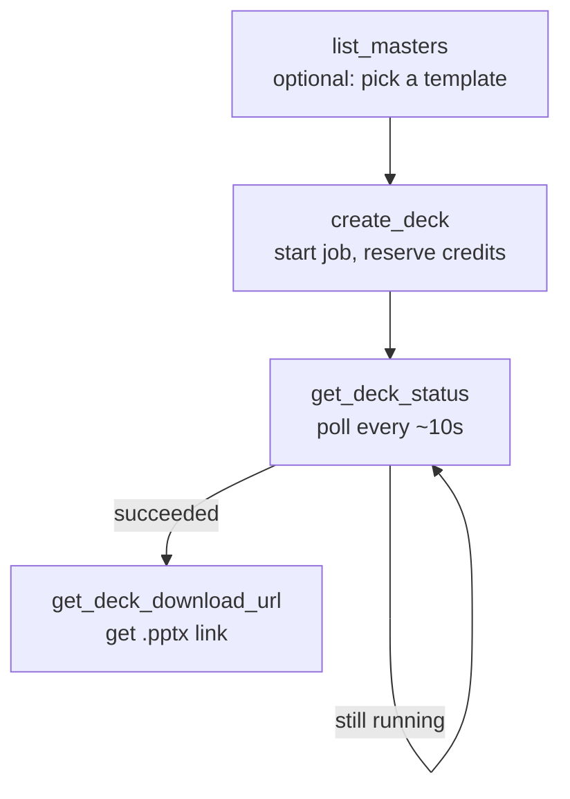

Decky AI exposes 7 tools via MCP. Your AI assistant calls these automatically when you ask it to generate or manage decks.

## Typical workflow

## Tools

<CardGroup cols={2}>
  <Card title="create_deck" icon="plus" href="/tools/create-deck">
    Queue a PowerPoint deck generation job.
  </Card>
  <Card title="get_deck_status" icon="magnifying-glass" href="/tools/get-deck-status">
    Check status and progress of a job.
  </Card>
  <Card title="get_deck_download_url" icon="download" href="/tools/get-deck-download-url">
    Get a short-lived `.pptx` download link.
  </Card>
  <Card title="list_decks" icon="list" href="/tools/list-decks">
    List your recent deck jobs.
  </Card>
  <Card title="cancel_deck" icon="ban" href="/tools/cancel-deck">
    Cancel a queued or running job.
  </Card>
  <Card title="list_masters" icon="palette" href="/tools/list-masters">
    List your uploaded brand templates.
  </Card>
  <Card title="check_usage" icon="coins" href="/tools/check-usage">
    Check your credit balance and plan.
  </Card>
</CardGroup>

## Summary

| Tool | Type | Required scope | Cost |
| --- | --- | --- | --- |
| [`create_deck`](/tools/create-deck) | Write | `decks:write` | 10 credits × slides |
| [`get_deck_status`](/tools/get-deck-status) | Read | `decks:read` | Free |
| [`get_deck_download_url`](/tools/get-deck-download-url) | Read | `decks:read` | Free |
| [`list_decks`](/tools/list-decks) | Read | `decks:read` | Free |
| [`cancel_deck`](/tools/cancel-deck) | Write | `decks:write` | Free (credits refunded) |
| [`list_masters`](/tools/list-masters) | Read | `masters:read` | Free |
| [`check_usage`](/tools/check-usage) | Read | `usage:read` | Free |
